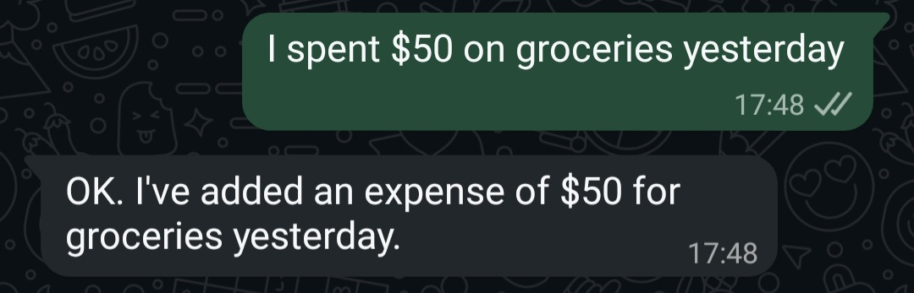
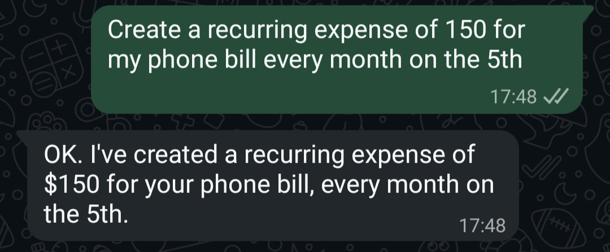
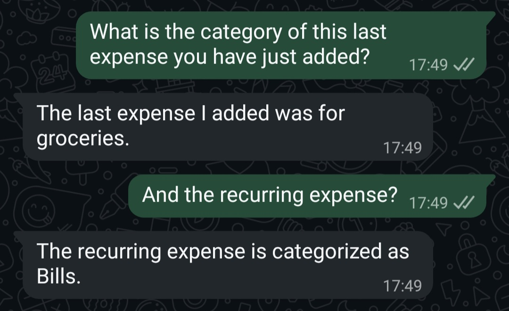
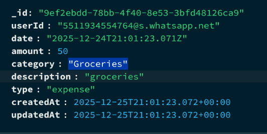
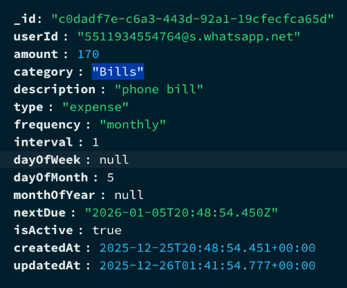
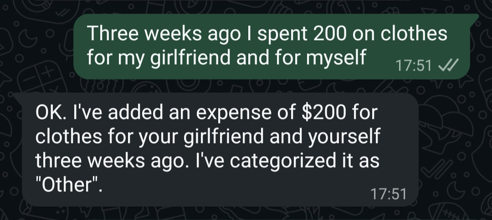
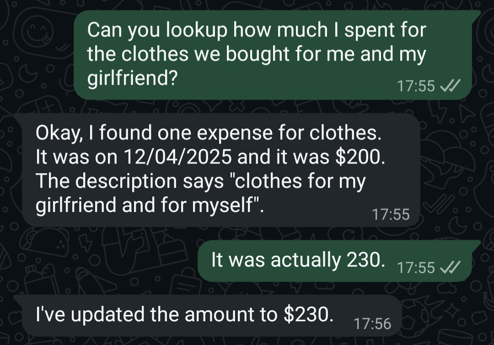
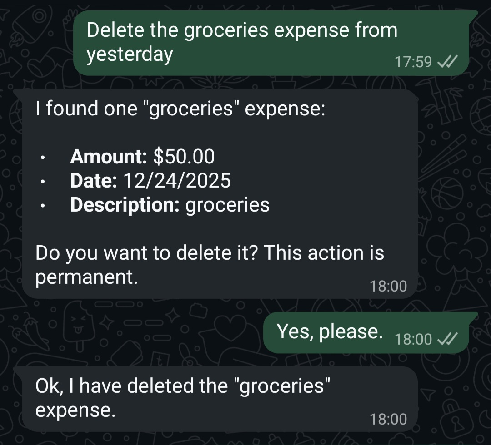
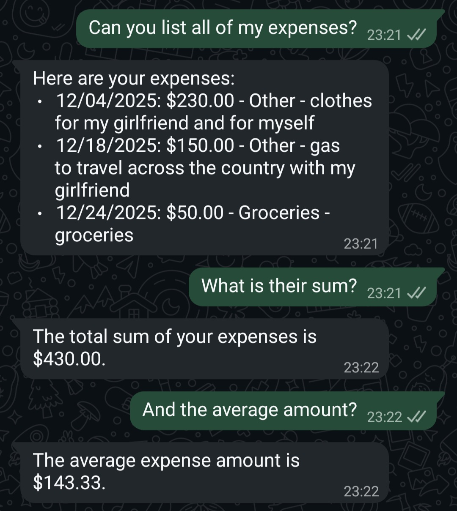
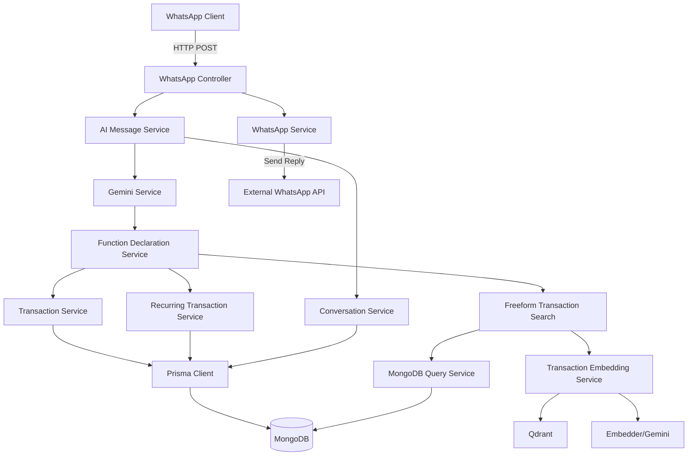

# Expense Tracker Bot

## Overview
WhatsApp-based financial tracking bot that uses Google Gemini AI for natural language processing. Users send transaction messages via WhatsApp (e.g., "I spent $25 on coffee yesterday"), and the bot extracts structured data to store expenses and income in MongoDB. The system maintains conversation history for context-aware responses and supports complex queries through AI function calling.

## Tech Stack
- **Runtime**: Node.js 20 (TypeScript)
- **Framework**: Express.js 5
- **Database**: MongoDB 8.2 (with replica set support)
- **Vector Database**: Qdrant (for semantic search)
- **ORM**: Prisma 6.19
- **AI**: Google Gemini API (@google/genai)
  - Model: gemini-2.0-flash (configurable)
  - Embeddings: gemini-embedding-001
- **Natural Language Processing**: chrono-node (date parsing)

## Features

### Natural Language Transaction Entry
Users send conversational messages to add expenses or income. The AI extracts amount, category, date, and description automatically.
- Example: "I spent $50 on groceries yesterday"
- Supports both expenses and income transactions
- Automatic date parsing (relative dates like "yesterday", "last Friday")



### Recurring Transaction Management
Create and manage recurring expenses/income (subscriptions, bills, salaries).
- Supported frequencies: daily, weekly, monthly, yearly
- Configurable intervals (e.g., "every 2 weeks")
- Automatic scheduling with next due date calculation
- Enable/disable recurring transactions



### AI-Powered Category Classification
Automatic category assignment based on transaction descriptions using Google Gemini AI.
- 15 expense categories (Food & Dining, Transportation, Shopping, etc.)
- 10 income categories (Salary, Freelance, Investment Returns, etc.)
- Fuzzy matching and normalization for user-provided categories
- Fallback to "Other" when classification is uncertain





### Semantic Transaction Search
Vector-based search using Qdrant for finding transactions by natural language queries.
- Powered by Gemini embeddings (gemini-embedding-001)
- Searches transaction descriptions semantically
- Configurable similarity threshold (default: 0.8)
- Supports up to 200 results per query




### Transaction Editing & Deletion
Edit or delete transactions by ID or by querying (e.g., "edit my last coffee purchase").
- Edit last transaction or specific transaction by ID
- Batch deletion support (multiple transactions at once)
- Soft delete for recurring transactions (disable via isActive flag)
- Deletion confirmation window (default: 120 seconds)



### Flexible Search with MongoDB Aggregation
AI generates and executes MongoDB aggregation queries for custom reports.
- Natural language to MongoDB aggregation pipeline
- Supports filtering, grouping, sorting, limiting
- Automatic userId injection for security
- Optional semantic pre-filtering for text-based queries



## Running the Project

This project uses Docker Compose for orchestration with dependent services:
- **MongoDB** (replica set enabled for transactions)
- **Qdrant** (vector database)

The application is supposed to run alongside an external WhatsApp service that handles message sending/receiving.

As of now, the application is not containerized itself, but can be run locally with Node.js.

```bash
npm install          # Install dependencies
npm run dev          # Start with hot reload (nodemon + ts-node)
npm run build        # Compile TypeScript to dist/
npm start            # Run compiled production build
```

## Configuration
Take note of the `.env.example` file for required environment variables:

Beware that the `SYSTEM_INSTRUCTION` is defined in `src/config/systemInstruction.ts` and not configured via environment variables.

### Prisma Configuration
Prisma client is generated to a custom output path: `src/generated/prisma`. After schema changes, run:
```bash
npx prisma db push  # MongoDB schema sync
npx prisma generate  # Regenerate client
```

## Usage

### WhatsApp Webhook Integration
The bot exposes a webhook endpoint at `POST /whatsapp` that receives messages from an external WhatsApp service.

**Webhook Payload Format**:
```json
{
  "remoteJid": "1234567890@s.whatsapp.net",
  "text": "I spent $25 on coffee yesterday",
  "pushName": "User Name",
  "fromMe": false
}
```

**Webhook Response Format**:
```json
{
  "success": true,
  "message": "Expense added: $25.00 for Food & Dining on 2025-12-23",
  "functionUsed": "addTransaction",
  "functionCalls": ["getCurrentDate", "addTransaction"],
  "iterations": 2
}
```

### API Endpoints
- `POST /whatsapp` - Main webhook for receiving WhatsApp messages
- `POST /whatsapp/conversation/clear/:userId` - Clear conversation history for a user

**Note**: WhatsApp message sending is handled by an external service configured via `WHATSAPP_API_URL`.

## Architecture

### High-Level Overview


### Service Layers

**Controllers** (`src/controllers/`)
- `WhatsAppController`: Handles webhook requests, validates payloads, orchestrates AI message processing

**Services - AI** (`src/services/ai/`)
- **Conversational**:
  - `AIMessageService`: Orchestrates iterative function calling loop (up to max iterations)
  - `GeminiService`: Direct interface to Google Gemini API
  - `FunctionDeclarationService`: Defines available functions and executes them
- **Embedding**:
  - `Embedder`: Wraps Gemini embedding API
  - `QdrantService`: Vector storage and retrieval
  - `TransactionEmbeddingService`: Stores/searches transaction embeddings

**Services - Business** (`src/services/business/`)
- `TransactionService`: Core transaction CRUD operations (add, edit, delete)
- `RecurringTransactionService`: Recurring transaction management
- `CategoryClassificationService`: AI-powered category assignment
- `TransactionLookupService`: Find transactions by various criteria
- `FreeformTransactionSearchService`: Semantic + MongoDB aggregation queries
- `MqlTransactionSearchService`: MongoDB aggregation pipeline execution

**Services - Infrastructure** (`src/services/infrastructure/`)
- `ConversationService`: Persist and retrieve conversation history
- `WhatsAppService`: Send messages to external WhatsApp API
- `DeletionStateService`: Manage deletion confirmation state
- `PrismaClientManager`: Singleton Prisma client
- `MongoConnectionManager`: MongoDB connection management

**Domain Objects** (`src/domain/`)
- `RecurrencePattern`: Encapsulates recurrence logic (frequency, next due date calculation)

**Validators** (`src/validators/`)
- `TransactionValidator`: Validate transaction data (never throws, returns `ValidationResult`)
- `RecurringTransactionValidator`: Validate recurring transaction data

**Utilities** (`src/lib/`)
- `CategoryNormalizer`: Fuzzy match categories based on transaction type
- `DateNormalizer`: Parse natural language dates using chrono-node
- `MessageBuilder`: Format user-friendly success messages
- `TransactionEmbeddingHelpers`: Generate text for embeddings
- `WhatsAppPostProcessor`: Format responses for WhatsApp

### Key Design Patterns

**Composition Over Inheritance**: Services compose shared utilities (CategoryNormalizer, PrismaClientManager) rather than extending base classes.

**ServiceResult Pattern**: All service methods return `ServiceResult<T>` with structured success/failure states. Validators return `ValidationResult` objects instead of throwing exceptions.

**Dependency Injection**: `DependencyService` singleton initializes and wires all services at startup.

**Repository Pattern**: Database access abstracted through repositories (though some services directly use Prisma).

**AI Function Calling Loop**: AIMessageService maintains conversation history as `Content[]` array, iteratively calling Gemini until no more function calls are returned.

### Data Models (Prisma Schema)

**Transaction**: One-time expense or income
- Fields: id, userId, date (ISO string), amount, category, description, type
- Optional link to recurring transaction via `recurringTransactionId`

**RecurringTransaction**: Recurring expense or income
- Fields: id, userId, amount, category, description, type
- Recurrence: frequency, interval, dayOfWeek, dayOfMonth, monthOfYear
- Status: isActive, nextDue (ISO string)

**Conversation**: User conversation history
- Fields: id, userId, createdAt, updatedAt
- Relation: One-to-many with Message

**Message**: Individual message in conversation
- Fields: id, conversationId, role (user/model), content (JSON stringified)
